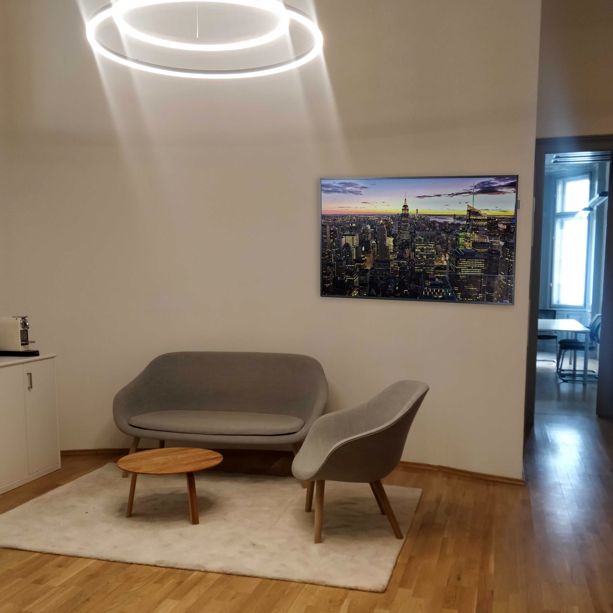
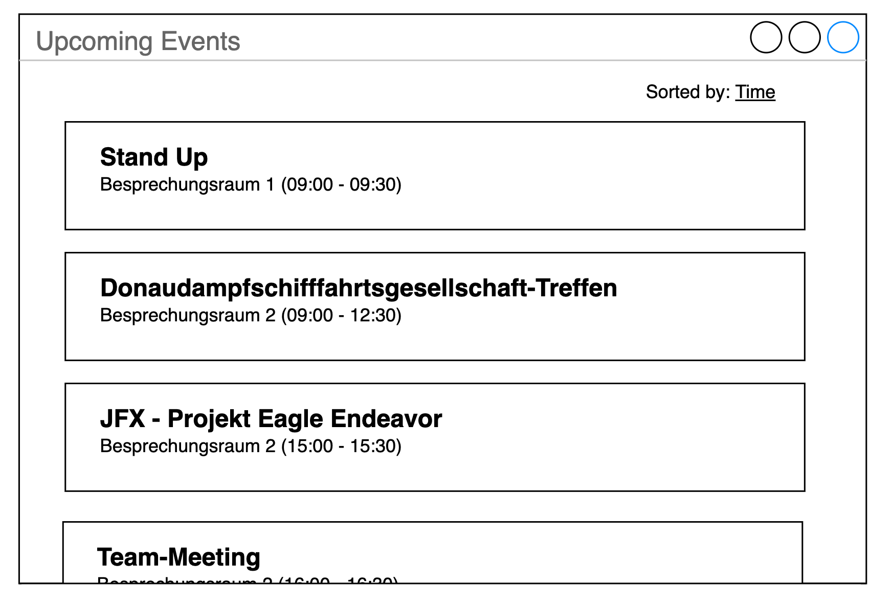

# Homework: Welcome Screen

## Anforderung
Im Zuge der Büro-Revitalisierung hat Treskon das Vorzimmer zum Lounge-Bereich umgeschaltet. Im Zuge der Renovierung soll es auch nun Digital Signage geben, wobei Besucher die Agenda von Besprechungsräumen, Allgemeine Informationen und Image-Videos sehen können. Es handelt sich dabei um einen "professionellen Fernseher" welcher ohne Tuner aber dafür mit integriertem Browser und für den 24/7 Betrieb ausgelegt ist.

Wichtig ist, dass die Administration des Contents (Termine, Videos, Ankündigungen) durch jeden Mitarbeiter, ohne Vorkenntnisse möglich ist. 

## Umsetzung
Die App wird als HTML5 App realisiert damit sie am Device mit einem modernen Browser angezeigt werden kann. Auch die Administrationsoberfläche ist integriert und somit browser-based.

Folgende Visualisierung wurde im Rahmen der Raumplanung erarbeitet:

## Mockups
Die Liste der nächsten Termine soll genügend Platz für längere Terminnamen haben als auch den Ort und Von-Bis Uhrzeit anzeigen können:

## Grundlegende Überlegungen
* Termine werden in Outlook (Office365) verwaltet und basieren auf den vorhandenen Räumen
* Kernelement ist die Anzeige der nächsten Termine
* Die App soll auch in der Lage sein Content wie Videos oder Text (Persönliche Begrüßungen, wichtige Informationen) anzuzeigen
* Der Content wird in einer einfachen Playlist verwaltet 
* Es wäre ein "Nice-To-Have" wenn der interne Web-Browser des Displays genutzt werden kann, allerdings gibt es schon schlechte Erfahrungsberichte diesbezüglich
* Die App besitzt einen View wo der Content abgespielt wird und einen View zur Administration

## Git-Repository
Die Testvideos sind per git erreichbar: https://github.com/treskon/homework-2-js

## Abnahme
Das Repository ist zu forken und dann im privaten Space zu entwickeln. Die Aufgabe ist dann abgeschlossen wenn die Entwicklungsdateien wieder in git hochgeladen sind. Die Abnahmekritieren sind unterhalb in den User-Stories als User-Acceptance-Tests (UAT) definiert...

## User-Stories

### Termine anzeigen
Als Besucher möchte in der Lounge die nächsten Termine die heute geplant sind sehen, damit ich weiß wann welcher Besprechungsraum besetzt ist bzw. verfügbar ist.

*UAT*
* Die nächsten Termine sollen in einer Liste sichtbar sein.
* Jeder Termin soll beinhalten: Betreff, Besprechungsraum/Ort, Beginn und Ende
* Falls ein Termin vergangen ist, soll er nicht mit mehr angezeigt werden
* Falls heute kein Termin geplant ist, soll der Benutzer darüber informiert werden  
* Termine können per Klick auf die Spalten sortiert werden
* Termine werden von mehreren Räumen (=Ressourcen in Outlook genannt) berücksichtigt: Besprechungsraum 1, Bepsrechungsraum 2, Lounge, Treskon Workspace

### Content anzeigen
Als Mitarbeiter möchte ich, dass der Bildschirm alle relevanten Informationen, Videos und natürlich die nächsten Termine anzeigt damit meine Besucher über wichtige Informationen und eine Orientierung im Office haben wo der nächste Termin ist. 

*UAT* 
* Content wird auf einen Device mit 1920x1080 px im Querformat angezeigt. 
* Der Content (Videos, Bilder) wird grundsätzlich im Vollbild angezeigt.

### Playlists/Content verwalten
Als Mitarbeiter möchte ich eine Playlist erstellen, wobei ich bestimmen kann welche Videos, oder Informationen in welcher Reihenfolge angezeigt werden, damit ich die Inhalte ohne Programmierkenntnisse verwalten kann

*UAT*
* Ich kann mehrere Inhalte hintereinander definieren
* Ein Inhalt kann die Terminliste, Video, Bild (nice-to-have) oder Text sein
* Nice-To-Have: Für den Text kann Markdown verwendet werden
* Je Inhalt wird die Anzeige in Sekunden definiert (gilt auch für Videos)
* Inhalte können per Klick ausgeblendet werden (=0s), so kann ich Content ausblenden und muss ihn nicht jedes mal neu schreiben / neu definieren
* Die Bilder / Videos werden als Link eingebunden - die App speichert selbst keine Files, bzw. muss immer online sein

## Not Doing
Authentication: wird am Webserver für /admin Route umgesetzt (z.B mit Apache2 htaccess)

## Technische Spezifikationen / API's

### Office 365
* Zum Auslesen der Kalendereinträge wird die Microsoft Office 365 Graph API verwendet. Hier wird erklärt wie mittels Postman die API getestet werden kann: https://docs.microsoft.com/en-us/graph/use-postman. Auch sehr hilfreich ist der Graph Explorer: https://developer.microsoft.com/en-us/graph/graph-explorer. Die notwendigen Credentials werden separat zur Verfügung gestellt.